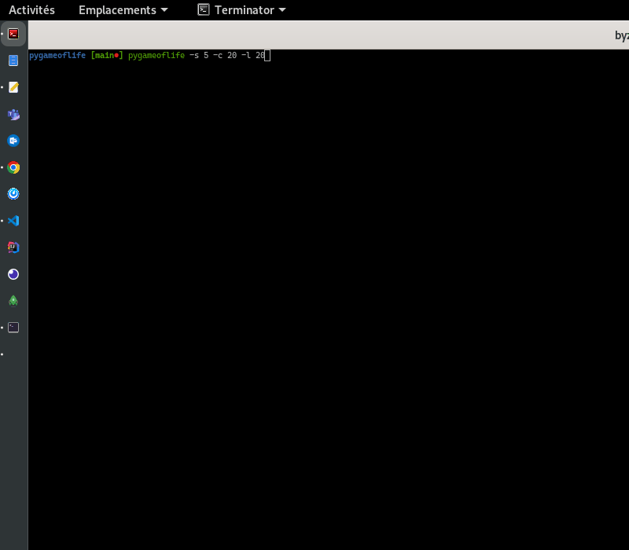

# :microbe: pyconwaysgame

The universe of the Game of Life is a two-dimensional orthogonal grid of square cells, 
each of which is in one of two possible states, live or dead (or populated and unpopulated, respectively). 
Every cell interacts with its eight neighbours, which are the cells that are horizontally, vertically, 
or diagonally adjacent. At each step in time, the following transitions occur: 

- Any live cell with fewer than two live neighbours dies, as if by underpopulation.
- Any live cell with two or three live neighbours lives on to the next generation.
- Any live cell with more than three live neighbours dies, as if by overpopulation.
- Any dead cell with exactly three live neighbours becomes a live cell, as if by reproduction.

## Démo


## 🚀 How to use **pyconwaysgame**

Just ... ``pyconwaysgame`` 

## 🚀🚀 Options

```
optional arguments:
  -h, --help         show the help message and exit
  -u, --update       self-update
  -d, --deaths       show deaths
  -s X, --speed X    speed factor, number of generation per second. 1 by default.
  -c X, --columns X  number of columns in the grid, 10 by default
  -l X, --lines X    number of lines in the grid, 10 by default
  -r X, --ratio X    ratio percentage of alived cells in initial grid (50 by default,
                     randomly for every cell)
  -B X, --born X     number of alived neighbours to born (3-3 by default)
  -S X, --survive X  number of alived neighbours to survive (2-3 by default)
```  
## ⚙️ Install/Upgrade

### Prerequisites

- Install Python 3 for your system
- Install pip3* for your system
- Install git for your system


 ### Installation 

``pip3 install pyconwaysgame``

### Upgrade


``pyconwaysgame -u``
 
 or

 `` pip3 install --upgrade pyconwaysgame``

*_Install pip instead of pip3, if pip3 does not exist for your OS_

## :package: Changelog

See [this page](CHANGELOG.md)

## License

MIT License

See [this page](LICENSE.txt) for details

