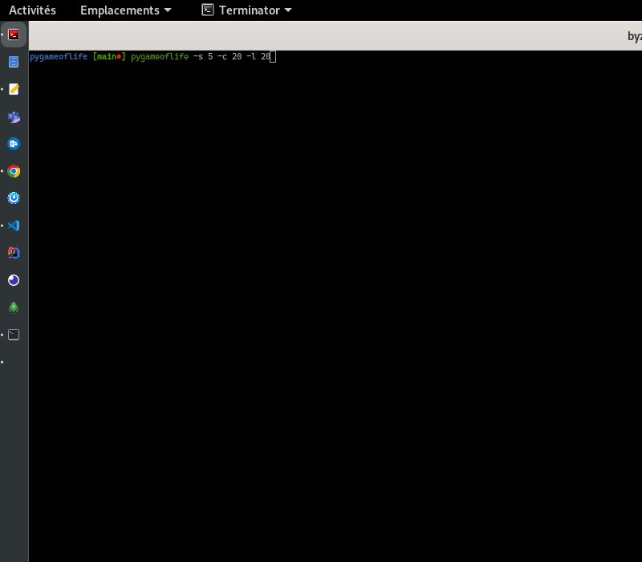

# :microbe: pyconwaysgame

The universe of the Game of Life is a two-dimensional orthogonal grid of square cells, 
each of which is in one of two possible states, live or dead (or populated and unpopulated, respectively). 
Every cell interacts with its eight neighbours, which are the cells that are horizontally, vertically, 
or diagonally adjacent. At each step in time, the following transitions occur: 

- Any live cell with fewer than two live neighbours dies, as if by underpopulation.
- Any live cell with two or three live neighbours lives on to the next generation.
- Any live cell with more than three live neighbours dies, as if by overpopulation.
- Any dead cell with exactly three live neighbours becomes a live cell, as if by reproduction.

## Démo


## 🚀 How to use **pyconwaysgame**

Just ... ``pyconwaysgame`` or for an example of pre-calculated map ``pyconwaysgame -t clock``

## 🚀🚀 Options

```
positional arguments:
  grid                grid file in txt format. 0/1/2 values in rectangular format. Without argument, the grid is randomly generated in 10*10 cells with 50 percent of alived

optional arguments:
  -h, --help          show this help message and exit
  -d, --deaths        show deaths cells in the previous generation
  -b, --ball          ball mode : bottom/up and left/right of the grid are respectively connected
  -n X, --number X    numer generation before stop
  -s X, --speed X     speed factor, number of generation per second. 1 by default. 0 to manual change with any key press, range : 0-10
  -B X, --born X      number of alived neighbours to born (3-3 by default), range : 0-8
  -S X, --survive X   number of alived neighbours to survive (2-3 by default), range : 0-8
  -c X, --columns X   number of columns in the randomed grid, 10 by default, range : 0-200
  -l X, --lines X     number of lines in the randomed grid, 10 by default, range : 0-200
  -r X, --ratio X     alived element probability ratio for each random grid cell (50 by default), range : 0-200
  -t X, --tutorial X  pre-calculated map, launch -t help to see availables map. Overrides few options as -b/-c/-l.
  -u, --update        self-update, alternatively, use pip(3) install --upgrade pyconwaysgame for manual update

```  
# ⚙️ Install

See [this page](INSTALL.md)

# :construction_worker: Contribution

See [this page](CONTRIBUTING.md)

# :package: Changelog

See [this page](CHANGELOG.md)


# License

MIT License

Copyright (c) 2022 [thib1984](https://github.com/thib1984)

See [this page](LICENSE.txt) for details

